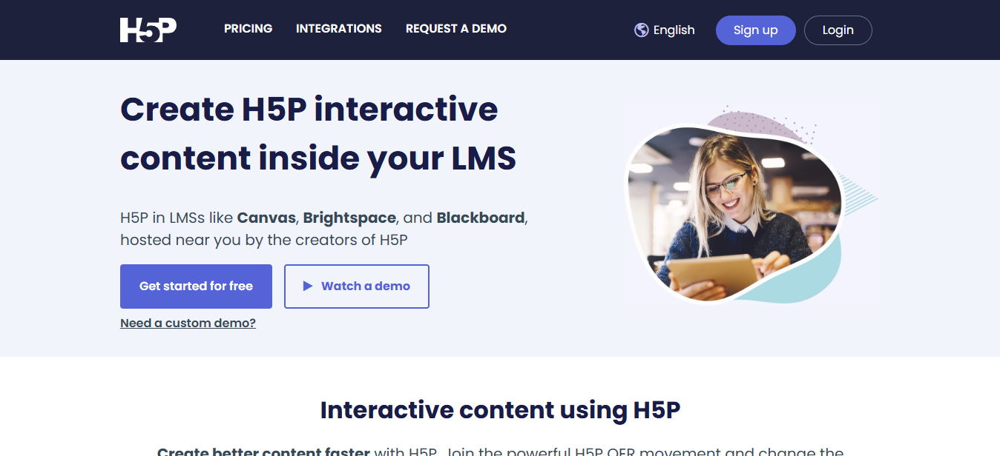
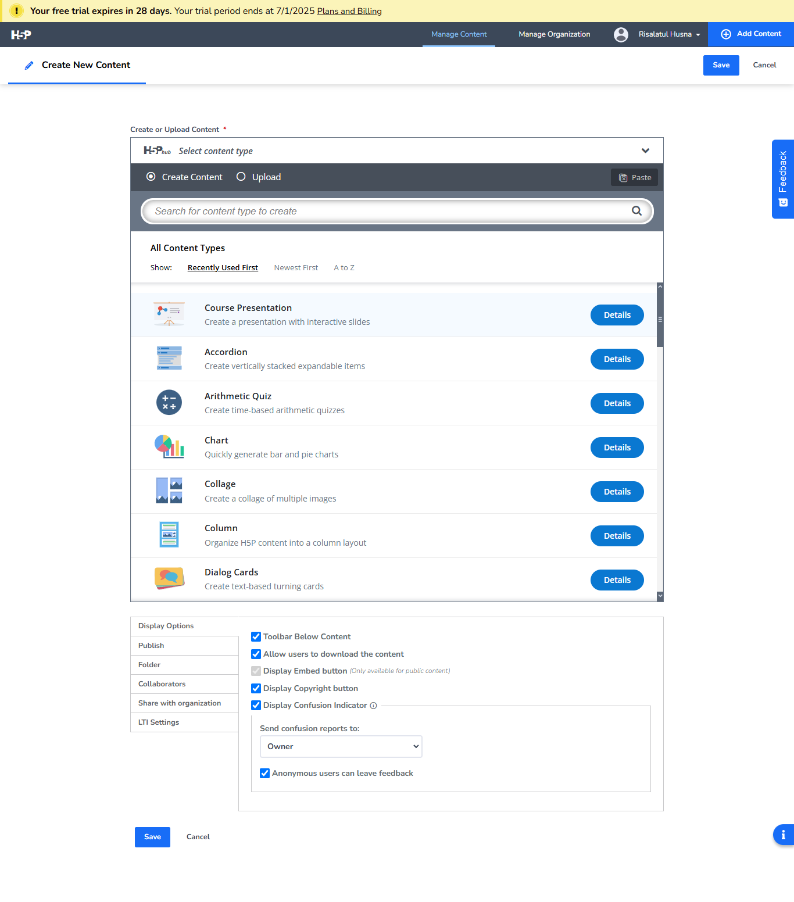

<h1 align = "center"><b>KETERANGAN</b></h1>

NAMA : RISALATUL HUSNA 
NIM : 2110131120008 
MATA KULIAH : PEMBELAJARAN BERBANTUAN KOMPUTER

<h1 align = "center"><b>TUGAS</b></h1>

Pelajari dan review aplikasi open source alternatif i-spring, resume di markdown.

---

### Penjelasan Tentang H5P

**Apa Itu H5P?**  

Gambar 1 Halaman Dashboard H5P

H5P adalah platform berbasis web yang memungkinkan pengguna membuat, berbagi, dan menggunakan konten interaktif dengan mudah. Nama H5P merupakan singkatan dari "HTML5 Package," yang menandakan penggunaan teknologi HTML5 untuk mendukung konten interaktif tanpa memerlukan plug-in tambahan. Aplikasi ini dapat diintegrasikan dengan berbagai Learning Management System (LMS) seperti Moodle, WordPress, dan Drupal. H5P digunakan secara luas untuk pembelajaran online, pelatihan, dan berbagai kebutuhan edukasi lainnya. H5P dapat diakses di link berikut : https://h5p.com/

**Siapa yang Menggunakan H5P?**  
H5P digunakan oleh pendidik, pengembang konten, perusahaan, hingga organisasi non-profit di seluruh dunia. Platform ini cocok untuk guru, dosen, atau pelatih yang ingin membuat konten pembelajaran interaktif dengan mudah tanpa memerlukan keahlian teknis pemrograman.

**Kapan dan Dimana H5P Digunakan?**  
H5P dirilis pertama kali pada tahun 2013 dan sejak itu terus berkembang. Aplikasi ini digunakan di berbagai situasi pembelajaran, baik formal maupun informal, seperti di ruang kelas, e-learning perusahaan, atau pelatihan jarak jauh. Dengan basis web, H5P dapat digunakan kapan saja dan di mana saja selama pengguna memiliki akses ke internet.

**Mengapa H5P Populer?**  
H5P populer karena kemudahan penggunaannya dan fleksibilitasnya dalam membuat berbagai jenis konten interaktif. Platform ini gratis dan berbasis open source, memungkinkan siapa saja mengakses fitur-fiturnya tanpa biaya. Keunggulan lainnya adalah kompatibilitasnya dengan berbagai perangkat, baik desktop maupun mobile.

**Bagaimana Cara Menggunakan H5P?**  
Untuk menggunakan H5P, pengguna hanya perlu mendaftar akun di situs resmi atau mengintegrasikan plugin H5P ke dalam LMS yang digunakan. Setelah itu, pengguna dapat memilih dari berbagai template interaktif, seperti kuis, video interaktif, presentasi, dan lainnya. Konten yang dibuat dapat diembed atau dibagikan dengan mudah.

---

### **Kelebihan H5P Dibandingkan Aplikasi Lain**
1. **Mudah Digunakan**: Antarmuka sederhana dan user-friendly membuat pengguna dari berbagai latar belakang teknologi dapat dengan cepat menguasainya.  
2. **Gratis dan Open Source**: Tidak memerlukan lisensi atau biaya tambahan, sehingga cocok untuk individu maupun institusi pendidikan.  
3. **Integrasi dengan LMS**: Mendukung integrasi langsung dengan platform seperti Moodle, WordPress, dan Drupal.  
4. **Fleksibilitas Konten**: Mendukung pembuatan berbagai format interaktif, mulai dari kuis, video interaktif, hingga simulasi.  
5. **Responsif**: Konten yang dibuat secara otomatis kompatibel dengan perangkat apapun, termasuk ponsel dan tablet.

### **Kekurangan H5P**
1. **Fitur Terbatas**: Meskipun memiliki banyak template, H5P memiliki keterbatasan dalam kustomisasi tingkat lanjut dibandingkan aplikasi premium seperti Articulate atau Adobe Captivate.  
2. **Tidak Mendukung Offline**: H5P hanya dapat digunakan secara online, sehingga memerlukan koneksi internet.  
3. **Kompleksitas Integrasi**: Meskipun mendukung berbagai LMS, pengguna pemula mungkin membutuhkan bantuan teknis saat mengintegrasikannya.  
4. **Performa pada Konten Besar**: Konten yang sangat kompleks atau berat mungkin memengaruhi performa, terutama di perangkat dengan spesifikasi rendah.  
5. **Kurangnya Analitik Lanjutan**: Analitik hasil pengguna lebih sederhana dibandingkan platform lain yang memiliki fitur pelaporan terperinci.

---

### **Manfaat H5P dalam Pembelajaran**
1. **Meningkatkan Interaktivitas**: Membuat pembelajaran lebih menarik dengan konten yang interaktif.  
2. **Mempermudah Evaluasi**: Menyediakan kuis dan tes interaktif untuk mengukur pemahaman siswa secara langsung.  
3. **Mendukung Belajar Mandiri**: Siswa dapat belajar kapan saja dan di mana saja dengan akses konten yang fleksibel.  
4. **Meningkatkan Partisipasi Siswa**: Interaktivitas yang tinggi membantu menjaga perhatian siswa dan meningkatkan keterlibatan mereka dalam proses belajar.  
5. **Efisiensi Waktu dan Biaya**: Dapat menggantikan kebutuhan materi cetak atau alat interaktif mahal lainnya.

---

### **Fitur-Fitur di H5P**

Gambar 2 Fitur-Fitur di H5P

1. **Interactive Video**: Menambahkan kuis, tautan, atau elemen interaktif ke dalam video.  
2. **Course Presentation**: Membuat presentasi interaktif yang mendukung media seperti video, teks, dan gambar.  
3. **Quiz (Multiple Choice, Drag and Drop, Fill in the Blanks)**: Berbagai jenis kuis yang dapat disesuaikan.  
4. **Interactive Book**: Membuat buku digital interaktif dengan navigasi yang mudah.  
5. **Timeline**: Menampilkan informasi secara kronologis dengan desain visual yang menarik.  
6. **Flashcards**: Alat bantu belajar untuk mengingat informasi dengan pasangan soal-jawaban.  
7. **Branching Scenario**: Membuat simulasi interaktif untuk skenario pengambilan keputusan.  
8. **Image Hotspots**: Menambahkan area interaktif pada gambar untuk memberikan penjelasan lebih lanjut.  
9. **Memory Game**: Permainan interaktif untuk membantu menghafal konsep.  
10. **Summary**: Membuat kesimpulan atau rangkuman dengan cara yang interaktif.  

H5P adalah alat yang sangat bermanfaat untuk pembelajaran modern karena memungkinkan siapa saja untuk membuat konten interaktif dengan cepat dan mudah, menjadikannya pilihan utama untuk pendidik dan pelatih.
