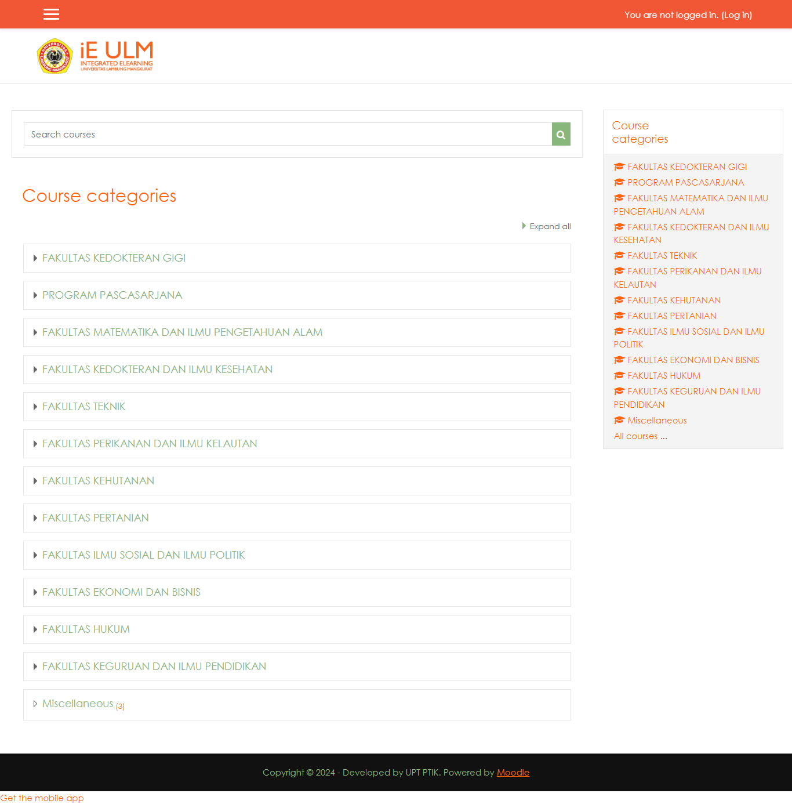

<h1 align = "center"><b>TUGAS PERTAMA</b></h1>

----

Carilah software sebagai Tutor, Tool, atau Tutee, kemudian buatlah review mengenai softwae tersebut.

#
<h1 align = "center"><b>PENYELESAIAN</b></h1>

---
#
# __Pendahuluan__

E-Learning telah menjadi komponen penting dalam pendidikan modern, memungkinkan akses yang lebih luas dan fleksibel terhadap materi pembelajaran. LMS (Learning Management System) adalah salah satu platform utama yang digunakan untuk mendukung pembelajaran daring, menyediakan berbagai alat untuk pengajaran, pembelajaran, dan administrasi pendidikan.

iE ULM adalah platform LMS yang dikembangkan oleh Universitas Lambung Mangkurat untuk mendukung proses pembelajaran daring. Platform ini bertujuan untuk menyediakan solusi pembelajaran yang terpadu, yang memungkinkan mahasiswa dan dosen untuk berinteraksi secara efektif melalui berbagai fitur digital.

Gambar 1 Halaman Dashboard iE ULM

#
# ___Konsep Tool dalam iE ULM___

 Tool adalah berbagai alat atau fitur yang disediakan oleh LMS untuk mendukung proses pembelajaran. Tool ini memungkinkan tutor dan mahasiswa untuk berinteraksi, mengakses materi pembelajaran, dan melaksanakan tugas-tugas akademik.

 Beberapa tool utama yang tersedia di iE ULM mencakup: 1. Upload Materi Pembelajaran  Tutor dapat mengunggah berbagai jenis materi pembelajaran, seperti video, dokumen, dan presentasi. Materi ini dapat diakses oleh mahasiswa kapan saja, memungkinkan fleksibilitas dalam belajar. 2. Membuat Kuis dan Ujian Online iE ULM menyediakan fitur untuk membuat kuis dan ujian yang dapat diakses secara online. Tool ini memungkinkan tutor untuk menguji pemahaman mahasiswa terhadap materi yang telah dipelajari. 3. Penugasan Fitur penugasan memungkinkan tutor untuk memberikan tugas individual atau kelompok. Mahasiswa dapat mengunggah hasil pekerjaan mereka, yang kemudian akan dinilai oleh tutor. 4. Pemberian Pengumuman Tool ini digunakan untuk menyampaikan informasi penting kepada seluruh peserta kelas, seperti perubahan jadwal, pemberitahuan tugas, atau materi tambahan.

# ___Konsep Tutor dalam iE ULM___

Tutor adalah pengajar atau fasilitator yang memainkan peran kunci dalam membimbing dan mengarahkan proses pembelajaran di platform E-Learning. Dalam konteks iE ULM, platform ini menyediakan berbagai fitur yang mendukung peran tutor dalam memastikan mahasiswa mendapatkan bimbingan yang diperlukan untuk mencapai hasil belajar yang optimal.

iE ULM dilengkapi dengan berbagai fitur yang dirancang untuk memudahkan tugas-tugas tutor, antara lain: 1. Pengelolaan Kelas iE ULM memungkinkan tutor untuk membuat dan mengelola kelas virtual dengan mudah, termasuk menambahkan materi pembelajaran, mengatur jadwal, dan mengelola peserta didik. 
2. Pemberian Tugas dan Penilaian Tutor dapat memberikan tugas kepada mahasiswa dan menilai pekerjaan mereka langsung di platform. Tugas-tugas dapat dilengkapi dengan instruksi rinci, tenggat waktu, dan kriteria penilaian yang jelas. 3. Forum Diskusi Fitur ini memungkinkan tutor untuk berinteraksi dengan mahasiswa di luar jam kelas. Forum dapat digunakan untuk menjawab pertanyaan, memberikan klarifikasi, dan mendorong diskusi kelompok. 4. Umpan Balik dan Komentar Tutor dapat memberikan umpan balik langsung pada pekerjaan mahasiswa, baik dalam bentuk komentar teks atau file yang disertakan dengan penilaian.

